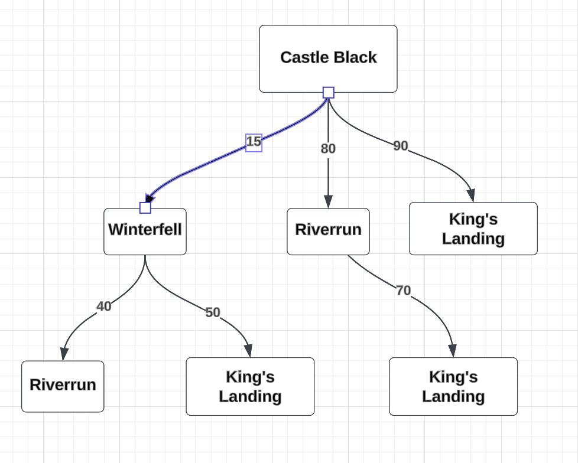

# flight-path


# Overview
The matrix represents flight connections, where zeros denote cities towards the south, and numbers in green indicate cities in the north.


# Graph Representation
Visualizing the matrix as a graph (see image below), each city is a node, and connections represent flight paths.



# Solution:
To address this problem, we employ a depth-first search approach. For instance, consider the journey from Castle Black to Riverrun. Possible paths include:

- Castle Black -> Riverrun
- Castle Black -> Winterfell -> Riverrun
## Calculating Total Price and Path:
Efficiently calculate the total price and path for optimal flight routes within the interconnected cities.

# Running the Code

## Setup

- The main logic resides in solution/flightpath.py.
- The code has no external dependencies or packages.
- Compatible with Python >= 3.7.

#### Steps to Run:

- Clone the repository.
- Navigate to the solution directory.
- Run the following command to find the flight path and price:

```bash
python flightpath.py 'Castle Black' 'Riverrun'
```
It will display the path and price on the screen.

#### Running Unit Tests:

```bash
python flightpath.test.py
```
